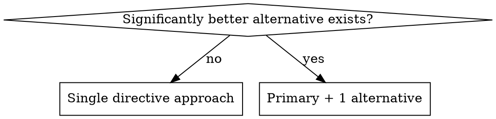

# Feature Research

## Overview

Systematically research a feature request to produce a single directive specification with zero open questions. All ambiguities are extracted into a structured CLARIFY file for user resolution.

**Workflow Position:** AFTER superpowers:brainstorming, BEFORE superpowers:writing-plans

## When to Use

Use when:
- Design direction is clear from brainstorming
- Need thorough technical research before planning implementation
- Need to understand integration points, APIs, data shapes, security considerations

**Don't use when:**
- Design is still unclear → Use superpowers:brainstorming first
- Simple changes (typo fixes, trivial updates)
- Already have complete technical specification

## Core Pattern

```
Feature Request → Research (docs first, then code) → 2 files:
  - Z01_{feature}_research.md (directive, zero questions)
  - Z01_CLARIFY_{feature}_research.md (questions only)
→ User answers CLARIFY → Update Z01_research.md → Hand to planning
```

## Research Output Format



**Single directive:** One clear approach (preserves existing patterns)
**Primary + 1 alternative:** Only if alternative is significantly better for specific use case
- Primary approach MUST preserve existing patterns from CLAUDE.md/docs
- Alternative approach has different trade-offs (e.g., microservice vs monolith)
- Both options have complete technical details (files, line ranges, pros/cons)
- User chooses, then update Z01_research.md to be fully directive

## Required Deliverables

**Exactly 2 files:**

1. **`docs/ai/ongoing/Z01_{feature}_research.md`** - Directive specification
   - What to implement (single approach OR primary + 1 alternative)
   - Files to change with line ranges
   - APIs, data shapes, integration points
   - Security, edge cases, test requirements

2. **`docs/ai/ongoing/Z01_CLARIFY_{feature}_research.md`** - Structured questions
   ```markdown
   Agent question: Should we use OAuth 2.0 or SAML?
   User response:

   Agent question: Expected request volume (requests/second)?
   User response:
   ```
   **Critical**: Leave "User response:" blank. No explanations.

## Implementation

### Step 1: Read Documentation FIRST

```bash
# MANDATORY FIRST - read these if they exist
read CLAUDE.md              # Patterns, conventions, forbidden approaches
read README.md              # Architecture overview
read ARCHITECTURE.md        # System design
glob "**/docs/**/*.md"      # All documentation
```

**Why:** CLAUDE.md contains mandatory patterns and forbidden approaches. Primary solution MUST preserve these patterns.

### Step 2: Explore Code

```bash
# Find related files
glob "**/*{keyword}*" "**/*{related_concept}*"

# Search for patterns
grep "{feature_pattern}" --type {lang}

# Read key files
read path/to/relevant/file.ext
```

### Step 3: Create Research File

**File**: `docs/ai/ongoing/Z01_{feature}_research.md` (use snake_case for feature name)

**Structure**:
```markdown
# {Feature} Research

## Summary
One paragraph: what and why.

## Current State
What exists. Files: path/to/file.py:123-145

## Existing Patterns & Documentation
### From CLAUDE.md
- Conventions that MUST be followed
- Architectural patterns to preserve
- Forbidden patterns/approaches

### Repository Structure
- Directory conventions
- File naming patterns

## Proposed Implementation

### Primary Approach (Preserves Existing Patterns)
- Architecture: How it fits existing system
- Files: path/to/file.py:50-75 - What changes
- Data shapes, APIs, integration points
- Security, edge cases, test requirements

### Alternative Approach (Optional - only if significantly better)
- Why different: [specific advantages for use case]
- Architecture, files, data shapes
- Trade-offs vs primary

## Integration Points
How this connects to existing code.

## Environment Variables
- VAR_NAME - purpose
```

### Step 4: Create CLARIFY File

**File**: `docs/ai/ongoing/Z01_CLARIFY_{feature}_research.md`

Every ambiguity, technology choice, or missing requirement:
```markdown
Agent question: {concise question}
User response:

Agent question: {next question}
User response:
```

### Step 5: Verify Directive Nature

Check Z01_research.md for vague questions:
- "Should we...?" → Move to CLARIFY
- "Options include..." (vague) → Make directive OR move to CLARIFY
- "We could..." (incomplete) → Make directive OR move to CLARIFY

**Acceptable:** Primary + 1 alternative with complete details for both
**Not acceptable:** Vague alternatives, 3+ options, questions embedded

## Research Checklist

**Documentation (FIRST):**
- [ ] CLAUDE.md patterns/forbidden approaches
- [ ] README/ARCHITECTURE docs
- [ ] Primary approach preserves existing patterns

**Technical:**
- [ ] APIs and endpoints
- [ ] Data shapes with line ranges
- [ ] Integration points
- [ ] Security, edge cases, failure modes
- [ ] Test requirements
- [ ] Environment variables

## Common Mistakes & Red Flags

| Mistake | Fix |
|---------|-----|
| Code before documentation | ALWAYS read CLAUDE.md/README/docs FIRST |
| Primary approach violates CLAUDE.md patterns | Primary MUST preserve existing patterns |
| 3+ documents | Only 2 files: Z01_research + Z01_CLARIFY |
| Questions in Z01_research.md | Move ALL questions to CLARIFY |
| Vague file references | Include path + line ranges |
| Missing "Existing Patterns" section | Always document and preserve patterns |

**Red Flags - STOP and Fix:**
- Did NOT read CLAUDE.md/README/docs first
- Primary approach violates forbidden patterns from CLAUDE.md
- More than 2 files created
- No file paths or line ranges
- CLARIFY has explanations

## Rationalization Table

| Excuse | Reality |
|--------|---------|
| "No CLAUDE.md exists, skip docs" | Still read README, docs/. Document patterns from code. |
| "Small feature, patterns don't matter" | Small violations create technical debt. Patterns ALWAYS matter. |
| "I can see the pattern in code" | CLAUDE.md may forbid what looks standard. Docs are truth. |
| "Questions need context for user" | User has conversation context. CLARIFY = questions only. |
| "Research = many documents" | Research = 2 files only. |
| "File paths in planning step" | Research includes files + line ranges NOW. |
| "User requested deprecation, decision is final" | "Deprecate X" sounds directive but may be premature. Question premise in CLARIFY. |
| "User suggested solution, proceed" | Still confirm via CLARIFY. No assumptions. |
| "This alternative is better, skip primary" | Primary preserving patterns is REQUIRED. |

## Example

**Good** (directive, 2 files, preserves patterns):
- `docs/ai/ongoing/Z01_oauth_authentication_research.md`
  - **Existing Patterns**: Service layer, no direct DB access (from CLAUDE.md)
  - **Primary Approach**: FastAPI with Authlib, preserves service layer
  - Files: src/api/auth.py:10-50, src/services/auth_service.py (new)
  - Complete: APIs, data shapes, security, tests, env vars
  - Zero questions in doc
- `docs/ai/ongoing/Z01_CLARIFY_oauth_authentication_research.md`
  - "Agent question: FastAPI or Flask?"
  - "Agent question: Expected concurrent users?"

## Handoff to Planning

When research complete:
1. Announce: "Research complete. Z01_research.md ready for planning."
2. If CLARIFY exists: "Waiting for Z01_CLARIFY.md answers"
3. After answered: Update Z01_research.md, then "Using superpowers:writing-plans"

**What planning receives:**
- Patterns that MUST be preserved (from CLAUDE.md)
- Forbidden approaches to AVOID
- Files that MUST be modified (with line ranges)
- APIs/libraries required
- Security/integration requirements
- When to proceed (user approval trigger)

## Success Criteria

- [ ] CLAUDE.md/README/docs read FIRST
- [ ] "Existing Patterns" section in Z01_research.md
- [ ] Primary approach preserves patterns
- [ ] Exactly 2 files: Z01_research.md + Z01_CLARIFY.md
- [ ] Z01_research.md is directive (single OR primary + 1 alternative)
- [ ] If alternative: both have complete technical details
- [ ] File paths + line ranges included
- [ ] CLARIFY uses exact format
- [ ] Implementer can code without architectural decisions
